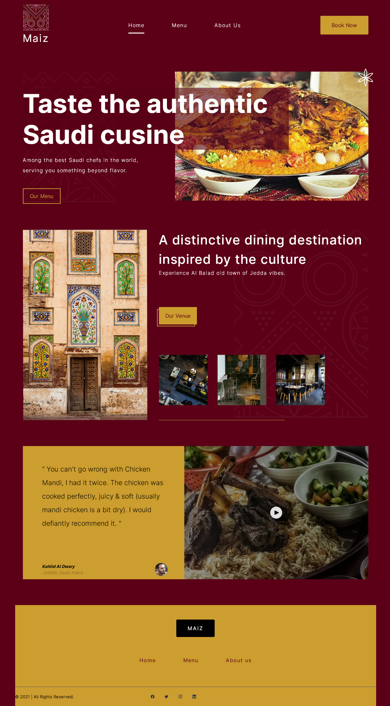
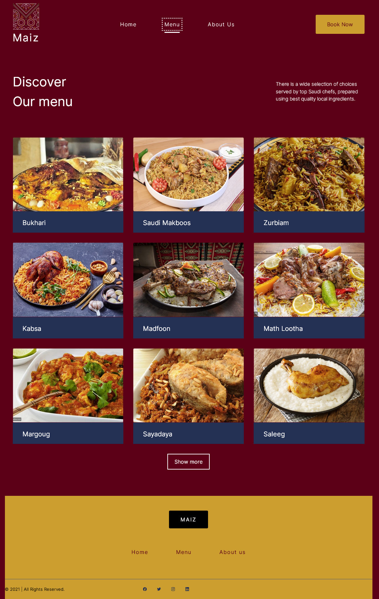
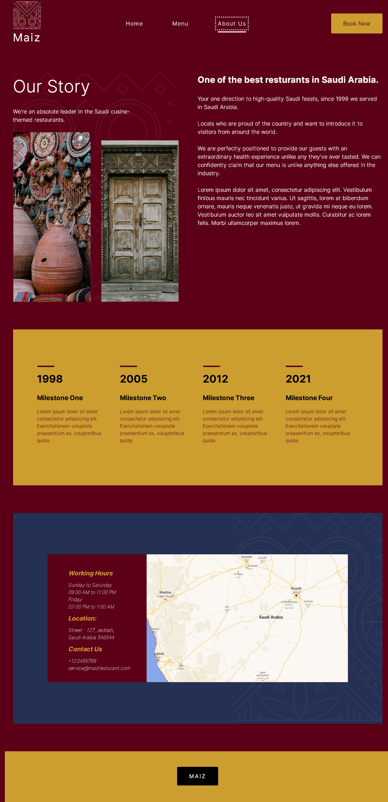

<div align="center">
<h1>The Odin Project Assignment</h1>
</div>


<div id="top"></div>
<!--
*** Thanks for checking out the Best-README-Template. If you have a suggestion
*** that would make this better, please fork the repo and create a pull request
*** or simply open an issue with the tag "enhancement".
*** Don't forget to give the project a star!
*** Thanks again! Now go create something AMAZING! :D
-->


<!-- PROJECT LOGO -->
<br />
<div align="center">
  <a href="https://github.com/github_username/repo_name">
    
  </a>

<h2 style ="font-size: 40px"align="center">Restaurant landing Page</h2>

  <p align="center">
    The Odin Project Assignment
    <br />
    <br />
    <a href="https://top-libary-app.vercel.app/">View Demo</a>
    ·
    <a href="https://www.theodinproject.com/lessons/node-path-javascript-restaurant-page">Link to the Assignment</a>
  </p>
</div>


<!-- TABLE OF CONTENTS -->
<details>
  <summary>Table of Contents</summary>
  <ol>
    <li>
      <a href="#about-the-project">About The Project</a>
      <ul>
        <li><a href="#built-with">Built With</a></li>
      </ul>
    </li>
    <li><a href="#usage">Usage</a></li>
    <li><a href="#contact">Contact</a></li>
    <li><a href="#acknowledgments">Acknowledgments</a></li>
  </ol>
</details>

</br>

<!-- ABOUT THE PROJECT -->
## About The Project


<p align="right">(<a href="#top">back to top</a>)</p>


### Built With
<div align="center">


</div>


 

</br>

### Design with


</br>

### Hostet on


<p align="right">(<a href="#top">back to top</a>)</p>


## Feature's

- [x] Project setup with Webpack
- [x] Three Pages: Home - Menu - About Us
- [x] HTML Elements completely generated with Javascript
- [x] Each Javascript logic is written in his Module
- [x] The logic to switch between Pages is written in the Index.js file.

    

<p align="right">(<a href="#top">back to top</a>)</p>

<!-- USAGE EXAMPLES -->
## Screenshot
<div style="width: 100%; display: flex; gap: 10px">

  <a href="https://github.com/github_username/repo_name">
      
    </a>
  <a href="https://github.com/github_username/repo_name">
      
  </a>
  <a href="https://github.com/github_username/repo_name">
      
  </a>
</div>

## Animation 


<p align="right">(<a href="#top">back to top</a>)</p>


## Acknowledgments
#### Dislodged Border for Buttons


```scss

.btn-dislodged {
    position: relative;
    padding: rem(15) rem(20);
    background-color: $primary-yellow-100;
    color: $primary-red-100;
    border-radius: 0;
   
}
.btn-dislodged::before {
    position: absolute;
    content: '';
    display: block;
    height: 100%;
    width: 100%;
    top: 6px;
    right: 6px;
    border: 2px solid $primary-yellow-100;

}
``` 


<p align="right">(<a href="#top">back to top</a>)</p>


<!-- CONTACT -->
## Contact

Astragenius - [@twitter_handle](https://twitter.com/twitter_handle) - email@email_client.com

Project Link: [Restaurant Landing Page](https://github.com/astragenius/TOP-Restaurant-landing-page)

<p align="right">(<a href="#top">back to top</a>)</p>


<!-- MARKDOWN LINKS & IMAGES -->
<!-- https://www.markdownguide.org/basic-syntax/#reference-style-links -->
[contributors-shield]: https://img.shields.io/github/contributors/github_username/repo_name.svg?style=for-the-badge
[contributors-url]: https://github.com/github_username/repo_name/graphs/contributors
[forks-shield]: https://img.shields.io/github/forks/github_username/repo_name.svg?style=for-the-badge
[forks-url]: https://github.com/github_username/repo_name/network/members
[stars-shield]: https://img.shields.io/github/stars/github_username/repo_name.svg?style=for-the-badge
[stars-url]: https://github.com/github_username/repo_name/stargazers
[issues-shield]: https://img.shields.io/github/issues/github_username/repo_name.svg?style=for-the-badge
[issues-url]: https://github.com/github_username/repo_name/issues
[license-shield]: https://img.shields.io/github/license/github_username/repo_name.svg?style=for-the-badge
[license-url]: https://github.com/github_username/repo_name/blob/master/LICENSE.txt
[linkedin-shield]: https://img.shields.io/badge/-LinkedIn-black.svg?style=for-the-badge&logo=linkedin&colorB=555
[linkedin-url]: https://linkedin.com/in/linkedin_username
[product-screenshot]: images/screenshot.png